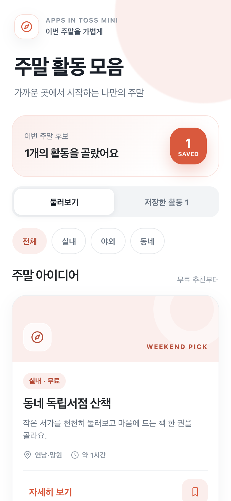
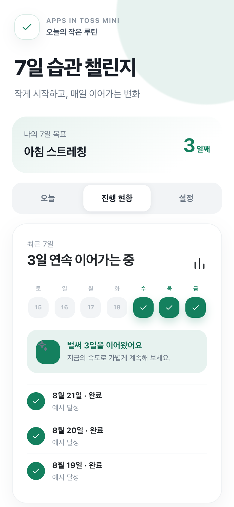
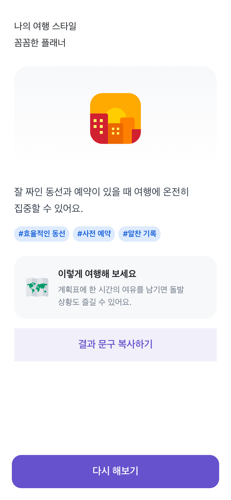
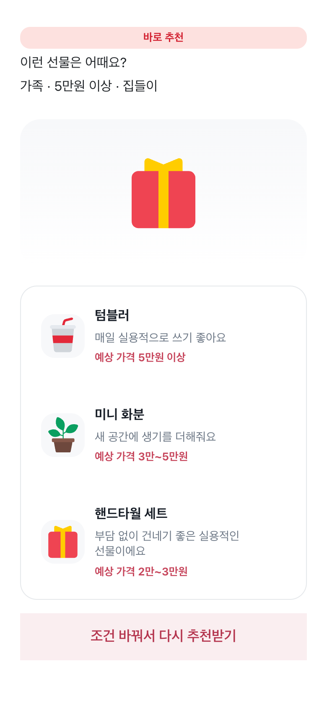

# 5. 실습 결과물 예시

수강생은 네 가지 유형 중 하나를 선택해 Codex로 내용을 바꾸고, 브라우저에서 확인한 뒤 Apps in Toss 콘솔에 올려 QR로 자신의 휴대폰에서 확인해요. 아래 이미지는 각 유형의 완성 예시이며, 수강생의 주제와 결과물은 선택한 내용에 따라 달라질 수 있어요.

## 1. 보고 저장하는 앱 — 주말 활동 모음

카테고리별 주말 활동을 비교하고 상세 내용을 확인한 뒤, 마음에 드는 활동을 내 주말 목록에 저장하는 앱이에요. 완성 예시는 무료 활동을 먼저 보여주고 방금 저장한 항목을 목록에서 바로 확인할 수 있어요.

## 2. 기록하고 이어가는 앱 — 7일 습관 챌린지

한 가지 습관을 정하고 오늘의 기분과 짧은 메모를 남기며, 최근 7일 진행률과 연속 달성일을 확인하는 앱이에요. 완성 예시는 3일 연속 달성 피드백을 함께 보여줘요.

## 3. 선택하고 결과를 보는 앱 — 여행 스타일 테스트

여섯 개 질문에 한 번씩 답하면 나의 여행 스타일, 핵심 키워드와 실용적인 여행 팁을 보여주는 앱이에요. 완성 예시에서는 결과 문구를 복사하거나 테스트를 다시 할 수 있어요.

## 4. 정보를 불러와 추천하는 앱 — 상황별 선물 찾기

받을 사람·예산·상황을 단계별로 고르고 조건을 확인하면, 추천 이유가 있는 선물 세 가지와 예상 가격을 보여주는 앱이에요.

이미지는 로컬 브라우저에서 `390×844 @2x`로 확인한 완성 예시예요. 네 complete 개발 서버를 `4171`~`4174` 포트에서 실행한 뒤 루트의 `pnpm capture:examples`로 같은 대표 상태를 다시 만들 수 있어요. Apps in Toss 콘솔 업로드, QR 실기기 확인, 검토 요청, 승인 또는 출시에 대한 증거는 아니며 QR 화면은 강사 사전 QA 뒤 별도로 준비해요.

이 예시 서비스에는 토스팀이 제공한 2D 토스페이스 원본이 적용되어 있어요. 사용하는 자산은 공식 저장소의 `v1.6.1`로 고정해 로컬에 포함했으며, 자세한 조건은 [토스페이스 저작권 안내](https://toss.im/tossface/copyright)에서 확인할 수 있어요.

## 작동 예시 MP4 로컬 파일

아래 파일은 완성 예시의 핵심 흐름을 약 30초로 녹화한 Google Drive 업로드 전 로컬 원본이에요.

| 예시 | 재생시간 | 녹화 흐름 | 파일 |
| --- | ---: | --- | --- |
| 주말 활동 모음 | 23.08초 | 활동 확인 → 상세 → 저장 → 저장 목록 | [01-weekend-activities-demo.mp4](../../recordings/final/01-weekend-activities-demo.mp4) |
| 7일 습관 챌린지 | 22.28초 | 기분 선택 → 메모 → 완료 → 3일 연속 기록 | [02-habit-challenge-demo.mp4](../../recordings/final/02-habit-challenge-demo.mp4) |
| 여행 스타일 테스트 | 25.72초 | 소개 → 6개 질문 → 결과 → 결과 문구 복사 | [03-travel-style-test-demo.mp4](../../recordings/final/03-travel-style-test-demo.mp4) |
| 상황별 선물 찾기 | 23.83초 | 대상 → 예산 → 상황 → 조건 검토 → 추천 3개 | [04-gift-finder-demo.mp4](../../recordings/final/04-gift-finder-demo.mp4) |

네 파일은 `780×1688`, H.264, 60fps, 무음으로 인코딩했어요. 포인터는 매 클릭 직전에 실제 DOM 요소의 중심과 hit target이 일치하는지 확인해요. 이 영상은 로컬 브라우저 작동 예시이며 Google Drive 업로드, Apps in Toss 실기기 동작, 콘솔 등록, 검토 요청, 승인 또는 출시 증거가 아니에요.
